# Unscrambling the Opposites Game

### [Deployed Game Link](https://unscrambling-opposites.herokuapp.com/)

This is a simple game that tests your vocabulary, but to add a bit of challenge, 
you have to unscramble the words to guess, whereas these words are the antonyms 
of the displayed meaning. It might be a bit confusing at first, but trust me, 
you'll get the hang of it real soon. Users will have the option to set how many 
games/words to guess you would like to play, choose between 10-20 games. The game 
will show you for each question, the jumbled words and the meaning of its possible
antonyms. Type in your guess, you have to unscramble it of course, the game will 
validate your answer straight away. Correct answers will be added to your points, 
which will be displayed after the game has ended. Whereas wrong answers of course 
do not earn you a point.
&nbsp;
## Table of Contents

- [UX](#ux)
    - [Users goals](#users-goals)
    - [Website owners goals](#website-owners-goals)
    - [Flow Chart](#flow-chart)
- [Features](#features)
    - [Game](#game)
    - [Future feature to implement](#future-feature-to-implement)
- [Technologies used](#tecnologies-used)
- [Libraries used](#libraries-used)
- [Testing and Validation](#testing-and-validation)
    - [PEP8](#pep8)
    - [Manual testing](#manual-testing)
    - [User stories testing](#user-stories-testing)
    - [Bugs](#bugs)
    - [Unfixed Bugs](#unfixed-bugs)
- [Deployment](#deployment)
    - [How to deploy](#how-to-deploy)
- [Credits](#credits)

&nbsp;
## User Experience

User Experience
The purpose of the game is to be really more educational than entertainment. 
To test how good the user's vocabulary is, particularly how well you know your 
antonyms. This is a simple command-line game written in Python.

### Users goals

- Users would have the ease of navigation all throughout the game, despite the game being a command-line game.
- Users would have the ability to always have an option to every question asked or to any action/steps that took place.
- Users would have a clear and readable and very easy to understand interface.
- Users would enjoy the game and would be encouraged to play more.
- Users will be notified of their action, say upon entering the games they want to play, validation and error messages would be available for users to help them enter data correctly.
- Users would be challenged by this game as words in the word bank are not typical words.
- Meanings provided are searched through the PyDictionary tool/package that offers a huge selection of words and their meanings.
- Users would definitely learn new words or be refreshed on the words they already know.  
- Users' knowledge of antonyms would definitely be tested on this game.
- Users will be notified whether their guesses are correct or not.
- Users will be given a tally of their points and will have the option to continue to play another game or just end it.

### Website owners goals
- Provide an educational vocabulary game for the users who are interested to enrich or test their vocabulary. For this game, particularly the antonyms.
- Be able to provide a clear and easy command-line navigation/interface to the user.
- Make necessary validations on user's input and display error messages if needed.
- Be able to provide a final score once the game is finished.
- Provide an option to the user how many times they wish to play or words they would like to guess and they should be able to play another new game should they wish.

[Back to Table of contents](#table-of-contents)
&nbsp;
### Flow Chart
As part of the development of the game, a flowchart was developed to establish 
the guidelines and structure of the application.

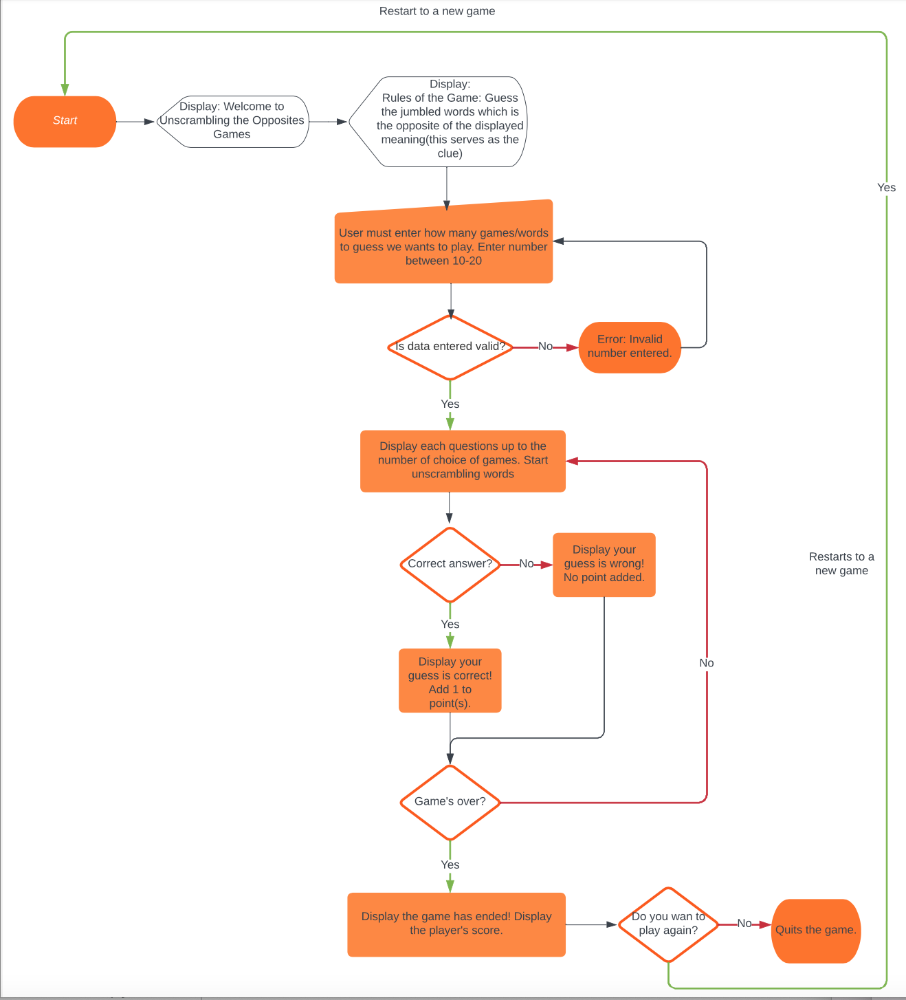
&nbsp;
[Back to Table of contents](#table-of-contents)
&nbsp;
## Features

Here's what the program looks like and how to play the game:

1. Welcome Screen/Main Page upon load. Displays the game name and the
   rules of the game. The game will start by asking the user the number 
   of games they want to play.
   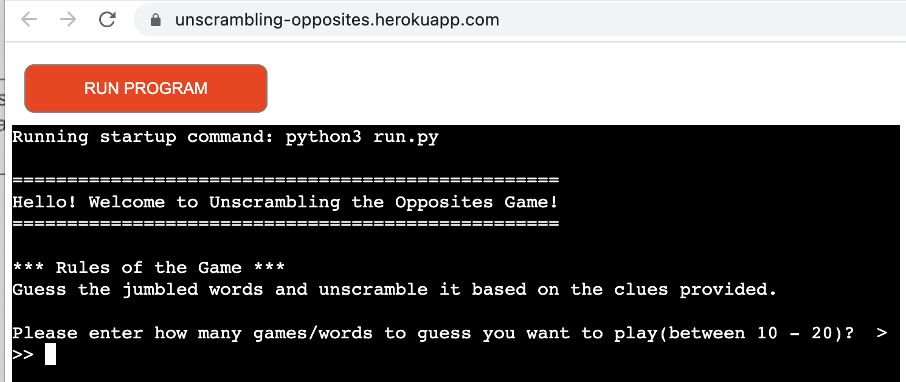

2. Rules of the game
   
   
   User will be first asked to enter the number of games they want 
   to play or words they wish to guess. Users must enter between 10-20.
   Input will then be validated next.
   The idea of the game is for the user to guess and unscramble the
   jumbled words, a meaning of the word is provided to serve as a clue.

   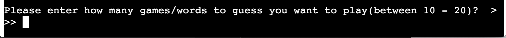

3. Validation of user's input
   Upon user's input of the number of games they wish to play, data
   will be validated, if it's between 10-20, if it is, the game will 
   start initialising the word bank and the game will start. 

   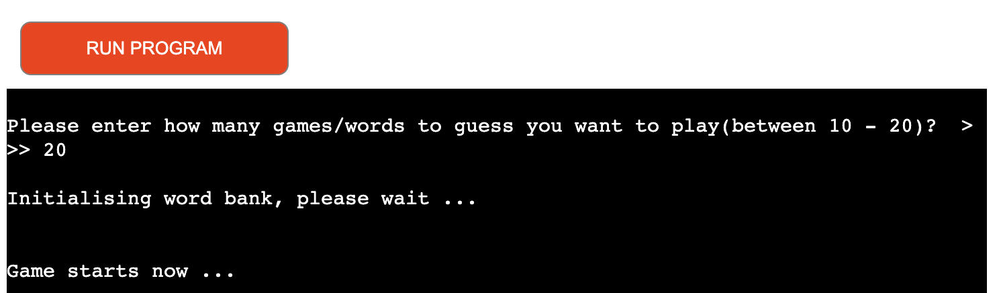

   However, should the user's input is wrong, the user will be notified 
   and asked to enter another number. 

   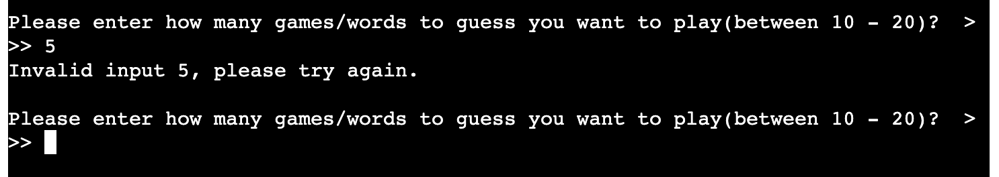

4. Word questions
   Once the data, which is the number of games is valid, the game will 
   now move on to the first question. 

   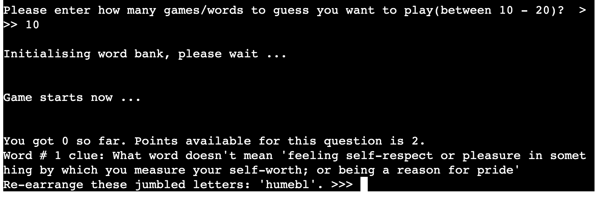

5. Correct answers
   Upon load of question, user may not unscramble the word, the meaning
   provided serves as a clue. 

   For every question, you could get a maximum of 2 points, if you got
   the correct answer on your first try, you would get 2 points for that
   question. 

   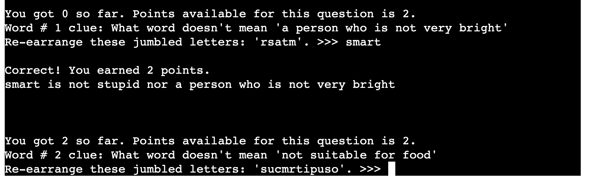

6. Incorrect answers

   If you didn't guess the word correctly, you can still try 1 more time
   but that will give you 1 point only. If you still didn't get it correct
   on the 2nd try, the next question will be displayed. Obviously you get
   0 points if you failed to guess it correctly 2 times.

   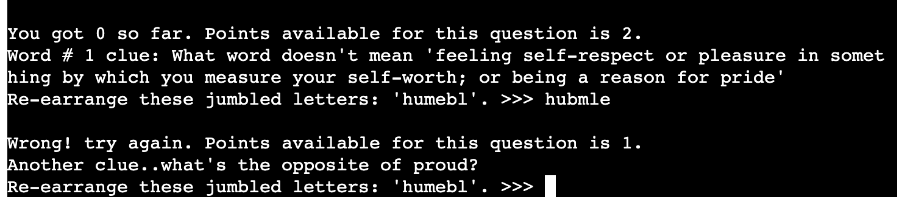

   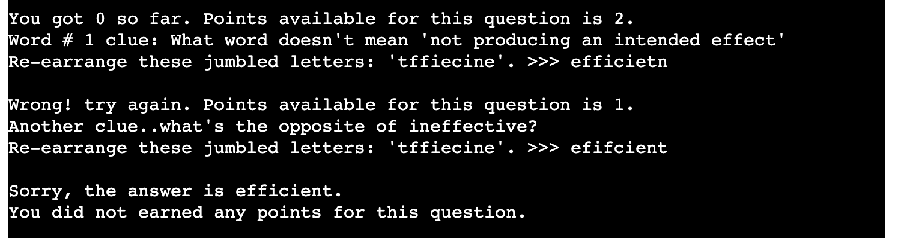

7. Game's over - Summary of scores 
   Once user has guessed the last question, the total and final score
   will be displayed.
   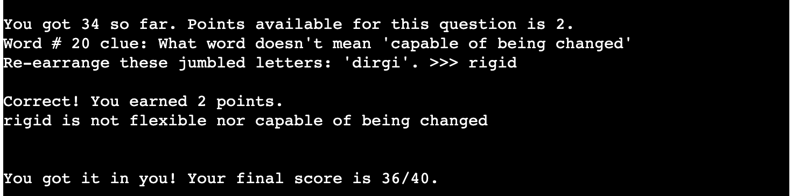

8. Play another game Y/N
   After scores are displayed, user will be asked to if he/she wants
   to play again. 

   

   If the user wants to play again, a new game will restart from the 
   beginning. 

   If the user doesn't want to play anymore, the game will bid goodbye
   and terminate. 

   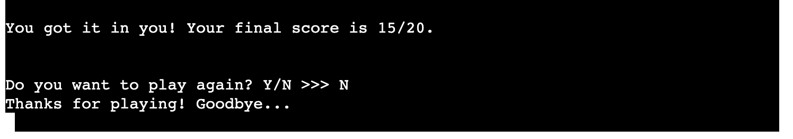

&nbsp;
[Back to Table of contents](#table-of-contents)

&nbsp;
## Future Features

- To use a better GUI, i.e. Textual Interface that is still command-line.
- To be able to add and store user profiles.
- To be able to provide different game modes.
- To use a spreadsheet or anything similar to store the vocabulary.

[Back to Table of contents](#table-of-contents)
## Technologies Used

- Python was used to code the application/game
- GitHub - Version control, used to store the repository
- GitPod - IDE used to code the program, testing and push to Github.
- Heroku - to deploy the application/game
- Lucidchart was used to design the flowchart.
- Gitpod was used to create this app and then push everything to 

### Libraries used
- random - to randomize the words
- os - used to get the environment variable ie. "devmode"
- argparse - used to parse command-line arguments. 
- pyDictionary - used to get the meaning of the words
&nbsp;

[Back to Table of contents](#table-of-contents)

&nbsp;

## Testing and Validation

### PEP8
The code was checked with PEP8 validator and passed with no significant error found.
Though it has a couple of warnings. 

- RESULTS- NO SIGNIFICANT ERROS 
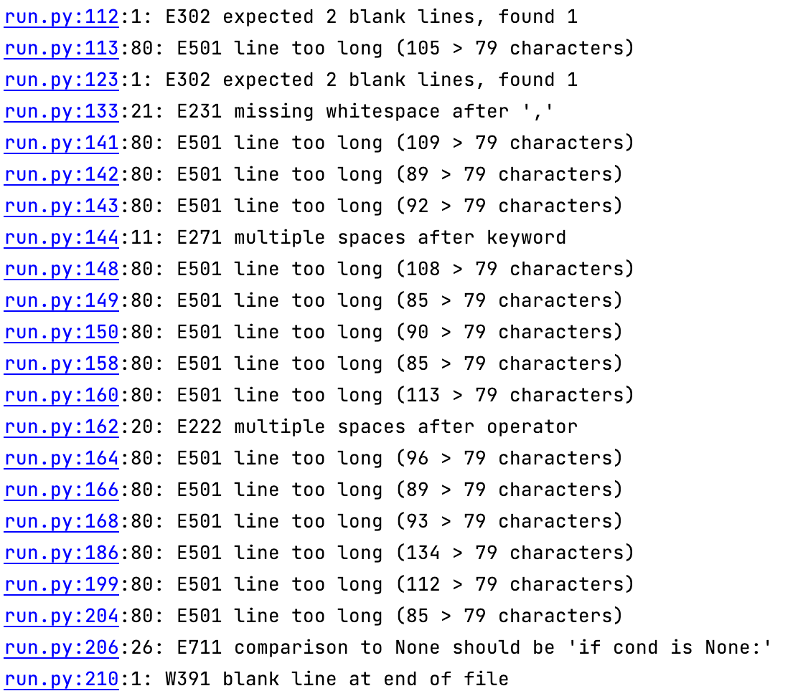

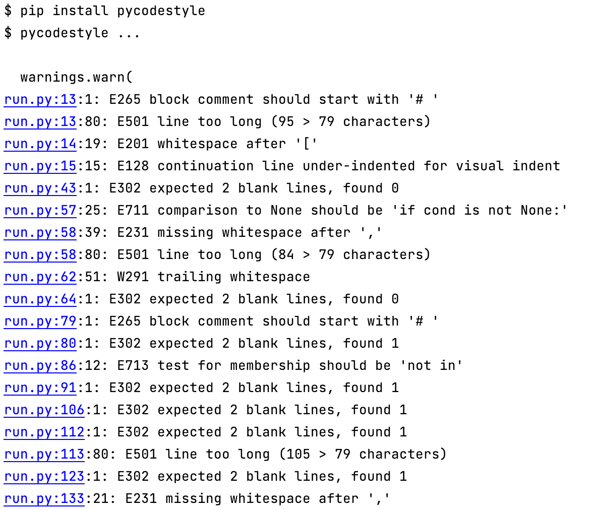

&nbsp;

### Manual testing
- All features and even vocabulary has been tested manually across different platforms 
and there were no significant errors.
- During testing, some meaning/definition that were pulled from pyDictionary 
  doesn't always make sense or 100% accurate, nevertheless, users may still have a
  bit of clue. 
- During testing all the errors/enhancements encountered were entered into GitHub 
  issues and this serves as guideline of the issues needs to be done/fixed. Once
  completed, issues are closed. 
&nbsp;

### Bugs
- Bugs or enhancements were entered into the GitHub Issues. 

&nbsp;

### Unfixed Bugs
- Meaning/definition from PyDictionary doesn't always give accurate or sensible 
  meaning. This is primarily on the PyDictionary and developers can't do anything 
  about it.
&nbsp;
## Deployment
There is only this main branch of the project version available in GitHub.
This version is also deployed live on Heroku - [Link]

### How to deploy
To deploy this page to Heroku from its [GitHub repository](https://github.com/alessandracosta8/Tic-Tac-Toe) the following steps were taken:

- Log into or register a new account at [Heroku](https://www.heroku.com/).
- Click on the button **New** in the top right corner of the dashboard.
- From the drop-down menu then select **Create new app**.
- Enter your app name in the first field, the names must be unique so check that the name you have chosen is available on Heroku, then select your region.
- Click on **Create App**.
- Once the app is created you will see the Overview panel of the application. Now move to the **Settings** tab.
- Once you are in the **Settings** tab scroll down till you find **Config Vars**.
- Press the button **Reveal Config Vars** and for the 'KEY' field, type in 'PORT' and for the value field type in '8000'.
  Then press the **Add** button.
- Scroll down to **Buildpacks**. Click the button **Add buildpack** and select 'python'. Do the same step and add 'node.js'.
  **PYTHON MUST BE ON TOP OF THE BUILDPACKS. IF IN YOUR CASE NODE.JS IS FIRST, CLICK AND DRAG PYTHON TO TOP AND SAVE.**
- Return back to the **Deploy** tab. From the deployment method, select 'Github' as the deployment.
- You will be asked to connect your github account. Confirm and proceed.
- Search for your repository name and connect.
- Once that is done and successfully connected, select how you want to push updates from the following options.

  _Clicking **Enable Automatic Deploys**. This will update once you push updates to your Github._

  _Selecting the correct branch for deployment from the drop-down menu and pressing **Deploy Branch** button. This will have to be done everytime manually._

&nbsp;
[Back to Table of contents](#table-of-contents)
&nbsp;
## Credits

- [Thesaurus.com](https://www.thesaurus.com) - to look up words.
- [W3 Schools](https://www.w3schools.com/)
- [OneByteAtATime](https://www.youtube.com/watch?v=cVm1We204bY) - youtube channel.
- [Github](https://github.com/marcin-kli/MP1/blob/Milestone-Projects/README.md) - README file example
- [GitHub](https://github.com/MustafaSahinci/project-portofolio-3) - clear screen function example

&nbsp;
[Back to Table of contents](#table-of-contents)
